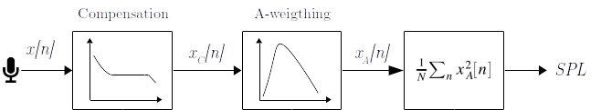

# AudioMoth-Firmware-SPL
This repository contains a firmware for AudioMoth. It consists in an adaptation of the firmware published in [AudioMoth-Project](https://github.com/OpenAcousticDevices/AudioMoth-Project) and [AudioMoth-Firmware-Basic](https://github.com/OpenAcousticDevices/AudioMoth-Firmware-Basic) to calculate SPL (dBA). 

We use the 1.3.0 version of AudioMoth firmware as a base. We add the SPL library (`src/spl.c` and `inc/spl.h`) that includes all the functions related to the SPL estimation. 

The main modifications of the `src/main.c` file of [AudioMoth-Firmware-Basic](https://github.com/OpenAcousticDevices/AudioMoth-Firmware-Basic) are in the [filter](https://github.com/OpenAcousticDevices/AudioMoth-Firmware-Basic/blob/master/main.c#L609). In this function, we add the call of the microphone frequency response compensation and the A-weighting filter of the signal. 

## SPL calculation

We estimate the SPL level using the audio signal recorded by the AudioMoth. We calculate the [LAeq,T](http://www.acoustic-glossary.co.uk/leq.htm) in the time basis, , defined by the record duration configured in AudioMoth. Therefore, for each wav file record in AudioMoth, a SPL value is calculated and saved into a log file in the SD card. Thus, if  is the signal recorded by AudioMoth, we estimate the SPL by the mean energy:


where  is the number of samples in the time , and  is the [A-weighted](http://www.acoustic-glossary.co.uk/frequency-weighting.htm) signal. Also, as the AudioMoth microphone does not have a flat frequency response, is necessary to apply a filter its response. Therefore before we calculate , we apply the filter compensation.



## Signal processing

In order to compensate the microphone frequency response and to apply the A-weighting to the signal, we implement different Infinite Impulse Response (IIR) filters. When the filter order is too high, we split it into parts (first or second order filters). Each of this parts is implemented by the [Direct-Form-II (DF-II)](https://ccrma.stanford.edu/~jos/filters/Direct_Form_II.html) realization. We base our implementation in the result of the [faust filter library](http://faust.grame.fr/editor/libraries/doc/library.html#fi.iir).

### Microphone response compensation
In order to have an almost flat microphone's frequency response, we implement an IIR filter that compensates the response in the low frequencies. In the near future, we are going to do some experiments to better do this compensation. See [Mic_compensation_filter](https://github.com/pzinemanas/AudioMoth-Firmware-SPL/blob/master/notebooks/Mic_compensation_filter.ipynb) notebook for more details about filter design process.

### A-weighting

Note that unlike other methods based on the frequency domain, we apply the weighting on the time-domain of the signal. See [A_weighting_filter](https://github.com/pzinemanas/AudioMoth-Firmware-SPL/blob/master/notebooks/A_weighting_filter.ipynb) notebook for more details.

## Using this firmware
### Flashing this firmware to Audiomoth
Flash the `bin/AudioMoth-Firmware-SPL.bin` file following the instructions from the [OpenAcoustic team](https://github.com/OpenAcousticDevices/Flash).

### Editing this firmware
To edit this firmware, clone this repository and follow the instructions from the [AudioMoth wiki](https://github.com/OpenAcousticDevices/AudioMoth-Project/wiki/AudioMoth). 

## Organization of the repository

This repository is organized as follows:

````
AudioMoth-Firmware-SPL/
|
|- src/ _______________________________ # Firmware source files
|  |- main.c __________________________ # Main program (edited from AudioMoth firmware 1.3.0)
|  |- AudiMoth.c ______________________ # AudioMoth library
|  |- spl.c ___________________________ # SPL library
|
|- inc/ _______________________________ # Firmware header files
|  |- AudiMoth.h ______________________ # AudioMoth header
|  |- spl.h ___________________________ # SPL library header
|
|- bin/
|  |- AudioMoth-Firmware-SPL.bin ______ # Compiled firmware ready to AudioMoth
|
|- notebooks/ _________________________ # Jupyter noteboks
|  |- A_weighting_filter.ipynb ________ # Filter design process of A_weighting filter
|  |- Mic_compensation_filter.ipynb ___ # Filter design process of compensation filter
````
Other folders are libraries includes in the AudioMoth original firmware.

## Licence
We use the same license (MIT) that [AudioMoth-Project](https://github.com/OpenAcousticDevices/AudioMoth-Project), Copyright (c) 2017 OpenAcousticDevices. Files `src/spl.c` and `inc/spl.h` and the modifications of `src/main.c` have Copyright (c) 2020 Pablo Zinemanas.

